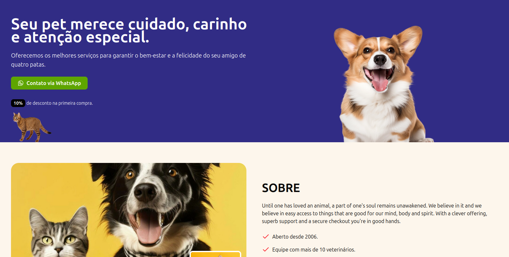

# 🐾 Pet Shop Dev - Responsive Landing Page

A clean and responsive landing page built with **Next.js**, designed with a focus on performance, accessibility, and a user-friendly layout.

🔗 **Live Demo:** [https://pets-yes-pripri.vercel.app](https://petshopdev2025.vercel.app/)

---

## ✨ Preview




---

## 🛠️ Technologies Used

- [Next.js](https://nextjs.org/)
- [React](https://react.dev/)
- [TypeScript](https://www.typescriptlang.org/)
- [Tailwind CSS](https://tailwindcss.com/)
- [Vercel](https://vercel.com/) for deployment

  
## 🚀 Getting Started

To run the project locally, follow these steps:

```bash
# 1. Clone the repository
git clone https://github.com/yes-pripri/Pets.git
cd Pets

# 2. Install dependencies
npm install

# 3. Run the development server
npm run dev

# The app will be available at:
# http://localhost:3000

```

---


📄 License

This project is licensed under the MIT License.
Feel free to use and modify it as you wish.

⭐️ If you liked it, don’t forget to give it a star!


